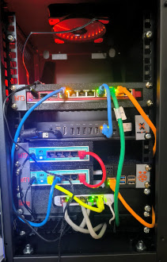

## Mój homelab 
zaczął powstawać jako potrzeba poznania sprzętu firmy Mikrotik. Zaczęło się od jednego routera, który poniewierał się po biurku. Potem doszedł kolejny i tak się zaczęło.
Obecnie szafa wygląda tak:

