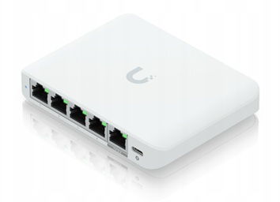

# Urządzenie "Gateway"

## UniFi Flex Mini 2.5G (USW-Flex-2.5G-5-EU) – Specyfikacja

| Kategoria                | Parametr                          | Wartość / Opis                                   |
|--------------------------|-----------------------------------|--------------------------------------------------|
| **Ogólne**               | Produkt                          | UniFi Switch Flex Mini 2.5G                     |
|                          | Model                            | **USW-Flex-2.5G-5-EU**                          |
|                          | Typ urządzenia                   | Zarządzalny switch Layer 2                      |
|                          | Przeznaczenie                    | SOHO / Edge / Desktop                           |
|                          | Obudowa                          | Plastikowa, desktop                              |
| **Porty Ethernet**       | Porty 2.5G                       | 5 × 2.5 GbE RJ45                                 |
|                          | Auto‑negocjacja                  | 100M / 1G / 2.5G                                 |
|                          | PoE‑IN                           | brak (zasilanie tylko DC)                       |
|                          | PoE‑OUT                          | brak                                            |
| **Wydajność**            | Przepustowość switching          | 25 Gbps (5 × 2.5G full‑duplex)                  |
|                          | Tablica MAC                      | ok. 8K wpisów                                   |
|                          | Bufor pakietów                   | kilka Mb (typowe dla małych switchy SOHO)       |
| **Funkcje L2**           | VLAN                             | 802.1Q (tagged/untagged), port VLAN             |
|                          | Link Aggregation                 | LAG / LACP (zależnie od wersji kontrolera)      |
|                          | IGMP Snooping                    | tak (dla multicast w sieci LAN)                 |
|                          | QoS                              | podstawowe, per‑port / per‑queue                |
|                          | Spanning Tree                    | STP / RSTP                                      |
| **Zarządzanie**          | Platforma                        | UniFi Network (UniFi Controller)                |
|                          | Metody adopcji                   | L2 discovery / L3, zdalna adopcja przez Cloud   |
|                          | Tryb standalone                  | ograniczony (bez kontrolera tylko podstawy)     |
| **Zasilanie**            | Zasilanie DC                     | 5 V DC (zasilacz w zestawie, USB‑C / barrel\*)  |
|                          | Pobór mocy                       | ~5–7 W (typowo)                                 |
|                          | Chłodzenie                       | Pasywne (fanless)                               |
| **Fizyczne**             | Montaż                           | Desktop (gumowe nóżki), opcj. ściana/uchwyt     |
|                          | Wymiary                          | ok. 100 × 100 × 30 mm                           |
|                          | Waga                             | ~0.2 kg                                         |
| **Środowisko pracy**     | Temperatura pracy                | 0°C … +40°C (typowo dla urządzeń SOHO)          |
|                          | Wilgotność                      | 5–95% bez kondensacji                           |
| **W zestawie**           | Zasilacz                         | 5 V DC (EU)                                     |
|                          | Inne                             | Instrukcja, elementy montażowe (w zależności od rynku) |