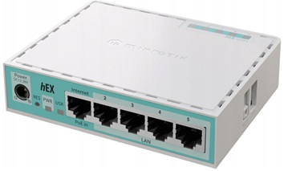
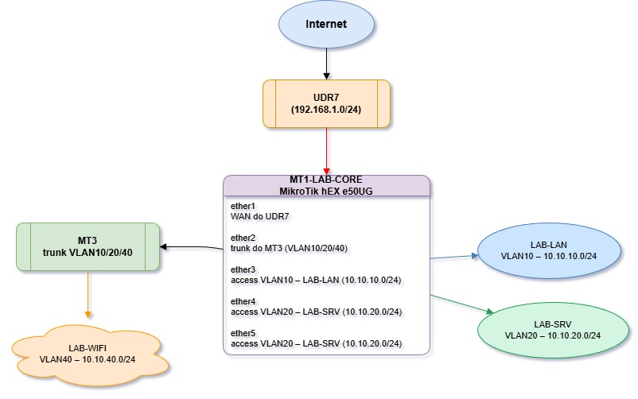

# Router MT1-LAB-CORE


### MikroTik hEX refresh (E50UG) – Specyfikacja

| Kategoria                | Parametr                          | Wartość / Opis                           |
|--------------------------|-----------------------------------|------------------------------------------|
| **Ogólne**               | Produkt                          | MikroTik hEX refresh                     |
|                          | Kod produktu                     | **E50UG**                                |
|                          | Architektura                     | ARM 32‑bit                               |
|                          | System operacyjny                | RouterOS v7                              |
|                          | Licencja RouterOS                | Level 4                                  |
|                          | Wymiary                          | 113 × 89 × 28 mm                         |
|                          | MTBF                             | ~100 000 h przy 25°C                     |
|                          | Temperatura pracy                | −40°C … +70°C                            |
| **CPU / RAM / Pamięć**   | CPU                              | EN7562CT (ARM dual‑core)                 |
|                          | Taktowanie CPU                   | 950 MHz                                  |
|                          | Liczba rdzeni                    | 2                                        |
|                          | Wątki CPU                        | 2                                        |
|                          | RAM                              | 512 MB                                   |
|                          | Pamięć masowa                    | 128 MB NAND                              |
| **Zasilanie**            | Liczba wejść zasilania           | 2 (DC jack, PoE‑IN)                      |
|                          | Napięcie DC (gniazdo)            | 12–28 V                                  |
|                          | PoE‑IN                           | Passive PoE, 12–28 V                     |
|                          | Max pobór mocy                   | 10 W                                     |
|                          | Max pobór mocy (bez dodatków)    | 4 W                                      |
|                          | Chłodzenie                       | Pasywne                                  |
| **Porty Ethernet**       | Porty 10/100/1000 Ethernet       | 5 × RJ45 (Gigabit)                       |
|                          | Układ switcha                    | EN7523                                   |
| **Porty dodatkowe**      | USB                              | 1 × USB Type‑A (max 1 A, power reset)    |
|                          | Porty SFP                        | brak                                     |
|                          | Sloty kart pamięci               | brak                                     |
|                          | Port szeregowy                   | brak                                     |
| **Funkcje sprzętowe**    | Monitor temperatury CPU          | tak                                      |
|                          | Monitor temperatury PCB          | tak                                      |
|                          | Monitor napięcia                 | tak                                      |
|                          | Przycisk Mode                    | tak                                      |
| **Certyfikaty**          | Certyfikacja                     | CE, EAC, RoHS                            |
|                          | Klasa IP                         | IP20                                     |
| **W zestawie**           | Zasilacz                         | 24 V 0.38 A DC                           |
|                          | Inne                             | Urządzenie z preinstalowanym RouterOS   |

## 🎯Rola MT1 w labie

`MT1-LAB-CORE` pełni funkcję głównego routera i bramy dla całego środowiska labowego. Jest to:

**Router brzegowy** – łączy lab z siecią główną (UDR7) przez WAN,

**Gateway dla VLANów** – obsługuje routing między podsieciami LAB-LAN, LAB-SRV, LAB-WIFI,

**DHCP server** – rozdaje adresy IP w każdym VLANie,

**NAT gateway** – maskuje ruch wychodzący z laba na WAN (masquerade),

**Trunk switch** – przekazuje VLANy do innych urządzeń (MT3, AP).

## 📐Architektura sieci



## 🔧Konfiguracja MT1 – szczegóły

### 3.1. Interfejsy fizyczne
| Port	| Rola |	Tryb |	VLAN(y)	| Opis |
|:-------:|:------:|:---------:|:----------:|:------:|
| ether1| WAN| –|	–|	Połączenie do UDR7 (DHCP client)|
|ether2|	Trunk do MT3|	trunk	|10, 20, 40 (tagged)|	Przekazuje wszystkie VLANy|
|ether3|	Access LAB-LAN|	access|	10 (untagged)	|Klienci LAB-LAN|
|ether4|	Access LAB-SRV|	access|	20 (untagged)|	Serwery / usługi (np. rpi5)|
|ether5|	Access LAB-SRV|	access|	20 (untagged)|	Dodatkowy port dla LAB-SRV|

### 3.2. Bridge i VLANy
- **Bridge** `bridge-lab`  
- **Typ**: switch logiczny (VLAN-aware bridge w RouterOS v7).  
- **Członkowie**: ether2, ether3, ether4, ether5.  
- **Funkcja**: agreguje porty i obsługuje VLANy. 

**Interfejsy VLAN na bridge-lab**

|Interfejs VLAN	|VLAN ID	|Adres IP (GW)	|Podsieć	|Rola|
|------------------|-----------|---------------|-----------|----|
|vlan10-lab	|10	|10.10.10.1/24	|10.10.10.0/24	|Gateway dla LAB-LAN
|vlan20-lab	|20	|10.10.20.1/24	|10.10.20.0/24	|Gateway dla LAB-SRV
|vlan40-lab	|40	|10.10.40.1/24	|10.10.40.0/24	|Gateway dla LAB-WIFI


### 3.3. DHCP serwery

MT1 działa jako DHCP server dla każdego VLANu:

|DHCP Pool|	Interfejs	|Zakres IP	|Gateway	|DNS|
|----------|------------|-----------|-----------|----|
dhcp-vlan10|	vlan10-lab	|10.10.10.100–200	|10.10.10.1	|10.10.20.10*
dhcp-vlan20|	vlan20-lab	|10.10.20.100–200	|10.10.20.1	|10.10.20.10*
dhcp-vlan40	|vlan40-lab	|10.10.40.100–200	|10.10.40.1	|10.10.20.10*

 *DNS wskazuje na Pi-hole (10.10.20.10), który działa w VLAN20 (LAB-SRV).

### 3.4. NAT (masquerade)

```routeros
/ip firewall nat
add chain=srcnat out-interface=ether1 action=masquerade comment="NAT lab -> WAN"
```
- **Źródło**: cały ruch z VLANów 10, 20, 40.  
- **Cel**: ether1 (WAN do UDR7).  
- **Efekt**: urządzenia w labie mają dostęp do Internetu przez UDR7.

### 3.5. Routing
MT1 routuje między VLANami:

**VLAN10 ↔ VLAN20** – np. klienci LAB-LAN mogą pingować serwery w LAB-SRV.  
**VLAN20 ↔ VLAN40** – serwery mogą obsługiwać WiFi.  
**Wszystkie VLANy → WAN** – przez NAT na ether1.

Domyślna trasa:

```routeros
/ip route
add dst-address=0.0.0.0/0 gateway=<DHCP-gateway-from-UDR7> comment="Default via UDR7"
```

### 3.6. Firewall (podstawowy)
Typowa konfiguracja dla laba:

```routeros
/ip firewall filter
# Akceptuj established/related
add chain=input connection-state=established,related action=accept
add chain=forward connection-state=established,related action=accept

# Akceptuj ICMP (ping)
add chain=input protocol=icmp action=accept

# Akceptuj dostęp do routera z LAB-LAN i LAB-SRV
add chain=input in-interface=vlan10-lab action=accept
add chain=input in-interface=vlan20-lab action=accept

# Blokuj resztę na input
add chain=input action=drop comment="Drop all other input"

# Forward między VLANami – domyślnie accept (lab)
add chain=forward action=accept comment="Allow inter-VLAN routing"
```
**Uwaga:** W środowisku produkcyjnym warto dodać bardziej restrykcyjne reguły (np. izolacja VLAN40 od VLAN10).

## 🔗 Integracja z resztą laba

### MT3 (switch / AP)
- Podłączony do `ether2` (trunk).
- Odbiera VLANy 10, 20, 40 i rozdziela je na porty access lub WiFi.
### rpi5 (serwer Docker)
- Podłączony do `ether4` lub `ether5` (VLAN20, LAB-SRV).
- Statyczny IP: `10.10.20.10`.
- Usługi: Pi-hole (DNS), Traefik, Portainer, Gitea, monitoring.
### Klienci LAB-LAN
- Podłączeni do `ether3` (VLAN10).
- Otrzymują IP przez DHCP (10.10.10.100–200).
- DNS → Pi-hole (10.10.20.10).
### WiFi (LAB-WIFI)
- VLAN40 przekazywany przez trunk (`ether2`) do MT3/AP.
- Klienci WiFi w `10.10.40.0/24`.
## 📋 Podsumowanie – kluczowe funkcje MT1

|Funkcja	|Opis|
|-----------|----|
**WAN Gateway**|	Łączy lab z siecią główną (UDR7) przez ether1 (DHCP client)
**Inter-VLAN Routing**	|Routuje między VLAN10, VLAN20, VLAN40
**DHCP Server**	|Rozdaje IP w każdym VLANie
**NAT (masquerade)**	|Maskuje ruch wychodzący z laba na WAN
**VLAN Trunk**	|Przekazuje VLANy do MT3 (ether2)
**DNS Redirect**|	DHCP wskazuje na Pi-hole (10.10.20.10) jako DNS
**Firewall**	|Podstawowa ochrona + kontrola dostępu do routera

## 🚀 Następne kroki
1. **Weryfikacja konfiguracji:**
```routeros
/interface bridge print
/interface vlan print
/ip address print
/ip dhcp-server print
/ip firewall nat print
```
2. **Testy łączności:**
  - Ping z klienta VLAN10 → `10.10.20.10` (Pi-hole).
  - Ping z rpi5 (VLAN20) → `8.8.8.8` (Internet).
  - `nslookup portainer.lab` z klienta → powinno zwrócić `10.10.20.10`.
3. **Backup konfiguracji:**
```routeros
/system backup save name=MT1-LAB-CORE-$(date +%Y%m%d)
/export file=MT1-LAB-CORE-config
```