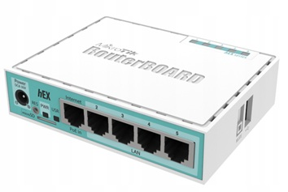

# Router MT2-LAB-ROUTER

## MikroTik hEX (RB750Gr3) – Specyfikacja

| Kategoria                | Parametr                          | Wartość / Opis                           |
|--------------------------|-----------------------------------|------------------------------------------|
| **Ogólne**               | Produkt                          | MikroTik hEX                             |
|                          | Kod produktu                     | **RB750Gr3**                             |
|                          | Architektura                     | MMIPS (MIPS 32‑bit)                      |
|                          | System operacyjny                | RouterOS                                  |
|                          | Licencja RouterOS                | Level 4                                   |
|                          | Wymiary                          | 113 × 89 × 28 mm                          |
|                          | Obudowa                          | Plastik                                   |
|                          | Temperatura pracy                | −40°C … +70°C                             |
| **CPU / RAM / Pamięć**   | CPU                              | MediaTek MT7621A                          |
|                          | Taktowanie CPU                   | 880 MHz                                   |
|                          | Liczba rdzeni                    | 2                                         |
|                          | RAM                              | 256 MB DDR3                               |
|                          | Pamięć masowa                    | 16 MB (FLASH)                             |
| **Zasilanie**            | Liczba wejść zasilania           | 2 (DC jack, PoE‑IN)                       |
|                          | Napięcie DC (gniazdo)            | 6–30 V DC                                 |
|                          | PoE‑IN                           | Passive PoE, 6–30 V                       |
|                          | Max pobór mocy                   | ok. 5 W                                   |
|                          | Chłodzenie                       | Pasywne                                    |
| **Porty Ethernet**       | Porty 10/100/1000 Ethernet       | 5 × RJ45 (Gigabit)                        |
|                          | Układ switcha                    | MediaTek (wbudowany w SoC)                |
| **Porty dodatkowe**      | USB                              | 1 × USB 2.0 Type‑A                        |
|                          | Porty SFP                        | brak                                      |
|                          | Sloty kart pamięci               | brak                                      |
|                          | Port szeregowy                   | brak (tylko poprzez piny na PCB)         |
| **Funkcje sprzętowe**    | Monitor temperatury              | tak                                       |
|                          | Monitor napięcia                 | tak                                       |
|                          | Przycisk Mode/Reset              | tak                                       |
| **Certyfikaty**          | Certyfikacja                     | CE, EAC, RoHS                             |
| **W zestawie**           | Zasilacz                         | 12 V DC (zależnie od wersji rynku)       |
|                          | Inne                             | Urządzenie z preinstalowanym RouterOS    |