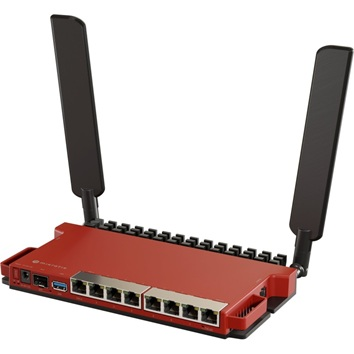

# Router MT3-LAB-WIFI

## MikroTik L009UiGS-2HaxD-IN – Specyfikacja

| Kategoria                | Parametr                          | Wartość / Opis                           |
|--------------------------|-----------------------------------|------------------------------------------|
| **Ogólne**               | Produkt                          | MikroTik L009UiGS-2HaxD-IN               |
|                          | Kod produktu                     | **L009UiGS-2HaxD-IN**                    |
|                          | Architektura                     | ARM 64‑bit                               |
|                          | System operacyjny                | RouterOS v7                              |
|                          | Licencja RouterOS                | Level 4                                  |
|                          | Wymiary                          | 200 × 132 × 44 mm                        |
|                          | Obudowa                          | Metal (desktop / rackmount)              |
|                          | Temperatura pracy                | −40°C … +70°C                            |
| **CPU / RAM / Pamięć**   | CPU                              | AL324 (ARM Cortex-A53)                   |
|                          | Taktowanie CPU                   | 1.4 GHz                                  |
|                          | Liczba rdzeni                    | 4                                        |
|                          | RAM                              | 1 GB DDR4                                |
|                          | Pamięć masowa                    | 128 MB NAND                              |
| **Zasilanie**            | Liczba wejść zasilania           | 2 (DC jack, PoE‑IN)                      |
|                          | Napięcie DC (gniazdo)            | 12–28 V DC                               |
|                          | PoE‑IN                           | 802.3af/at (PoE/PoE+)                    |
|                          | PoE‑OUT                          | 802.3af/at na portach 1–7                |
|                          | Max pobór mocy                   | ok. 25 W (bez urządzeń PoE)              |
|                          | Max moc PoE OUT                  | do 25 W (łącznie na wszystkie porty)     |
|                          | Chłodzenie                       | Pasywne (fanless)                        |
| **Porty Ethernet**       | Porty 10/100/1000 Ethernet       | 7 × RJ45 (Gigabit)                       |
|                          | Port 2.5 Gigabit Ethernet        | 1 × RJ45 (2.5G)                          |
|                          | Porty SFP+                       | 1 × SFP+ (10 Gbps)                       |
|                          | Układ switcha                    | Qualcomm (wbudowany)                     |
| **Wireless**             | Standard WiFi                    | Wi‑Fi 6 (802.11ax)                       |
|                          | Pasmo                            | 2.4 GHz                                  |
|                          | Moc TX                           | do 20 dBm (zależnie od regionu)          |
|                          | Anteny                           | 2 × wewnętrzne (2×2 MIMO)                |
| **Porty dodatkowe**      | USB                              | 1 × USB 3.0 Type‑A                       |
|                          | Port szeregowy (Console)         | tak (RJ45)                               |
|                          | Sloty kart pamięci               | brak                                     |
| **Funkcje sprzętowe**    | Monitor temperatury              | tak                                      |
|                          | Monitor napięcia                 | tak                                      |
|                          | Przycisk Mode/Reset              | tak                                      |
|                          | Wyświetlacz LCD                  | tak (dotykowy)                           |
| **Certyfikaty**          | Certyfikacja                     | CE, EAC, FCC, IC, RoHS                   |
| **W zestawie**           | Zasilacz                         | 24 V DC (zależnie od wersji rynku)       |
|                          | Uchwyty rack                     | tak (opcjonalnie)                        |
|                          | Inne                             | Urządzenie z preinstalowanym RouterOS v7 |