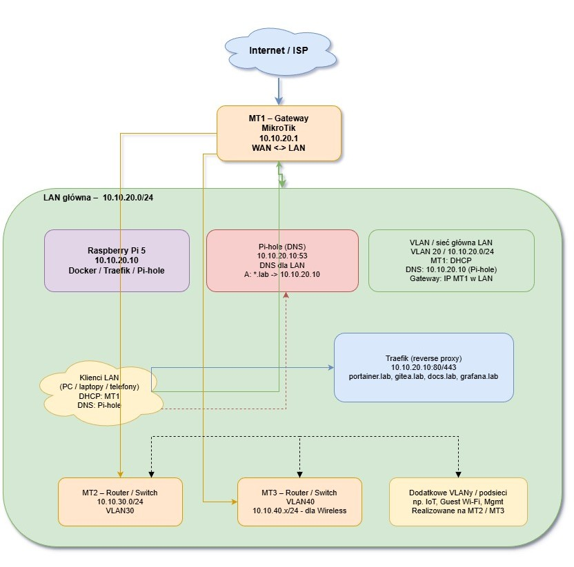

# Topologia sieci

## Ogólny opis

Homelab działa w oparciu o kilka routerów MikroTik (MT1, MT2, MT3) oraz gateway, z główną podsiecią LAN:

- Główna sieć LAN: `10.10.20.0/24`
- Główny serwer usług: **Raspberry Pi 5** (`10.10.20.10`)
- DNS: **Pi-hole** na rpi5 (`10.10.20.10`)
- Reverse proxy: **Traefik** w Dockerze na rpi5
- Klienci (PC, laptopy, telefony, inne serwery) otrzymują IP oraz DNS z MikroTika (DHCP).

Routery MikroTik (MT1/MT2/MT3) pełnią różne role (np. główny router, access pointy, routery w innych segmentach).  
W tej sekcji skupiam się na:

- podstawowej podsieci `10.10.20.0/24`,
- powiązaniu rpi5 z MikroTikami,
- przepływie ruchu (gateway, DNS, HTTP/HTTPS).
  

---

## Podstawowe komponenty

### Gateway - switch na granicy LAN/LAB

- Urządzenie: **Ubiquiti UniFi Flex Mini 2.5G USW-Flex-2.5G-5-EU** 
- Adres IP (w podsieci `192.168.1.0/24`): **192.168.1.117** 
- Rola:
  - do niego podłaczony jest główny router LABU,
  - rezerwowy dostęp do internetu w podsieci 192.168.1.0,
  - podłączone drukarki.

### Router MT1

- Typ: MikroTik **E50UG** 
- Rola:
  - (domyślnie) główny router / gateway dla sieci LAN,
  - serwer DHCP dla `10.10.20.0/24`,
  - punkt centralny dla połączeń z internetem,
  - przekazywanie DNS do Pi-hole (jako serwer DNS wskazywany klientom).

### Router MT2

- Typ: MikroTik **RB750Gr3**
- Rola:
  - dodatkowy router do testowania protokołów routingu,
  - router dla osobnej podsieci VLAN,
  - połączenie z MT1 – `osobna podsieć 10.10.30.0`, uplink `ether1-ether3`,
  - serwer DHCP dla podsieci `10.20.1.0` i `10.20.2.0` .

### Router MT3

- Typ: MikroTik **L009UIGS-2HAXD-IN 2.4 GHz**
- Rola:
  - access point `WiFi-MT` - adresy `10.10.40.0/24`/ `VLAN40`,
  - uplink do MT1 – `ether1 - ether2`.

---

## Raspberry Pi 5 w sieci

- Adres IP: `10.10.20.10`
- Lokalizacja: główna podsieć `10.10.20.0/24`
- Podpięcie:
  - przewodowo (Ethernet) do routera MT3 (`ether7`),
- Rola:
  - host dla Dockera i wszystkich podstawowych usług (Pi-hole, Traefik, Portainer, Gitea, monitoring),
  - centralny punkt usług `*.lab` dostępnych z LAN.

Przykładowe usługi na rpi5:

- `Pi-hole` – DNS + blokowanie reklam
- `Traefik` – reverse proxy
- `Portainer` – zarządzanie Dockerem
- `Gitea` – serwer Git
- `Grafana`, `Prometheus`, `Loki`, `Uptime Kuma` – monitoring i logi
- `MkDocs` (Material) – dokumentacja `docs.lab`

---

## Adresacja IP – główna podsieć

- Sieć: `10.10.20.0/24`
- Najważniejsze adresy:
  - Gateway (MikroTik / MT1): `10.10.20.1`  
  - Raspberry Pi 5: `10.10.20.10`
  - ASUS GQE10A (Proxmox): `10.10.20.100` 
  - ASUS TUF (laptop): `10.10.20.196`

---

## DHCP i DNS

### DHCP na MikroTikach

W głównej podsieci za DHCP odpowiada MikroTik (zwykle MT1):

- Pula adresów: `10.10.20.50-10.10.20.200` 
- Brama (`gateway`):  `10.10.20.1`
- DNS: **`10.10.20.10`** (Pi-hole na rpi5)

### DNS – Pi-hole

- Serwer DNS: `10.10.20.10` (Pi-hole w Dockerze na rpi5)
- Wszystkie klienty LAN:
  - wysyłają zapytania DNS do Pi-hole,
  - korzystają z lokalnych nazw `*.lab`,
  - mają filtrowane reklamy / trackery.

Lokalne domeny (przykłady):

- `portainer.lab` → `10.10.20.10`
- `gitea.lab` → `10.10.20.10`
- `docs.lab` → `10.10.20.10`
- docelowo: `grafana.lab`, `kuma.lab`, `loki.lab`, `traefik.lab`, itd.

Więcej szczegółów o DNS znajduje się w sekcji:  
`Usługi → DNS` (`docs/uslugi/dns.md`).

---

## Ruch HTTP/HTTPS – Traefik i domeny *.lab

Schemat działania dla usług HTTP/HTTPS:

1. Klient w LAN wpisuje w przeglądarce np. `http://gitea.lab`.
2. Zapytanie DNS trafia do Pi-hole (`10.10.20.10`), który zwraca IP rpi5 (`10.10.20.10`).
3. Przeglądarka łączy się z `10.10.20.10:80` (lub `443`) z nagłówkiem `Host: gitea.lab`.
4. Traefik na rpi5:
   - nasłuchuje na portach 80/443,
   - na podstawie reguł `Host("...")` kieruje ruch do odpowiednich kontenerów Dockera.
5. Użytkownik widzi interfejs odpowiedniej usługi (Portainer, Gitea, Docs, Grafana, itp.).

Podstawowe usługi za Traefikiem:

- `http://portainer.lab` → Portainer
- `http://docs.lab` → MkDocs (Material)
- `http://gitea.lab` → Gitea
- `http://grafana.lab` → Grafana
- itd.

---

## Połączenia między routerami (wysoki poziom)

*(ten fragment możesz doprecyzować pod swoje realne połączenia kablowe / VLAN)*

- MT1 (główny router/gateway) jest podłączony:
  - jednym interfejsem do internetu (port `ether1`),
  - innymi interfejsami do sieci LAN, gdzie siedzi rpi5.

- MT2 i MT3:
  - są połączone z MT1 jako dodatkowe routery / access pointy,
  - mogą obsługiwać inne segmentsy/VLAN-y (np. sieć gościnna, IoT, lab testowy),
  - ruch z ich podsieci przechodzi przez MT1/gateway do internetu i do rpi5.

Dzięki temu:

- rpi5 (`10.10.20.10`) i jego usługi są dostępne nie tylko z głównej podsieci, ale (w razie konfiguracji routingu) również z innych segmentów zarządzanych przez MT2/MT3,
- Pi-hole może obsługiwać DNS również dla innych podsieci, jeśli ruch DNS jest odpowiednio kierowany.

---

## Podsumowanie

- Główny LAN: `10.10.20.0/24` z gatewayem na MikroTiku.
- Raspberry Pi 5 (`10.10.20.10`) jest centralnym serwerem usług (Docker, Pi-hole, Traefik, itd.).
- Pi-hole (`10.10.20.10`) jest głównym DNS, ustawionym w DHCP na MikroTiku.
- Traefik zarządza ruchem HTTP/HTTPS dla nazw `*.lab`.
- Routery MT1/MT2/MT3 oraz gateway zapewniają:
  - dostęp do internetu,
  - routing między segmentami,
  - dystrybucję adresów IP (DHCP),
  - kierowanie ruchu do rpi5.

W osobnych sekcjach (`Router MT1`, `Router MT2`, `Router MT3`) opisuję szczegółowo konfigurację poszczególnych MikroTików (interfejsy, DHCP, VLAN, firewall, routing).

# Zestawienie parametrów sprzętu sieciowego - MikroTik: E50UG vs RB750Gr3 vs L009UiGS-2HaxD-IN

## 1. Zestawienie ogólne

| Cecha                    | E50UG (hEX refresh)                      | RB750Gr3 (hEX)                          | L009UiGS-2HaxD-IN                         |
|--------------------------|------------------------------------------|-----------------------------------------|-------------------------------------------|
| Typ urządzenia           | Router przewodowy, desktop               | Router przewodowy, desktop              | Router przewodowy + WiFi 2.4 GHz, metal   |
| Rola w labie             | Core router / brama VLAN                 | Core router „poprzednia generacja”      | Mocny core / edge z 10G i WiFi            |
| Architektura CPU         | ARM 32-bit                               | MIPS (MMIPS, 32-bit)                    | ARM 64-bit                                |
| RouterOS                 | v7                                      | v7 (obsługuje, ale „na styk”)           | v7 (native, docelowa platforma)           |
| Licencja RouterOS        | Level 4                                 | Level 4                                 | Level 4                                   |

---

## 2. CPU, RAM, pamięć

| Cecha                    | E50UG (hEX refresh)                      | RB750Gr3 (hEX)                          | L009UiGS-2HaxD-IN                         |
|--------------------------|------------------------------------------|-----------------------------------------|-------------------------------------------|
| CPU                      | EN7562CT, ARM dual-core                 | MT7621A, MIPS dual-core                 | AL324, ARM Cortex-A53 quad-core           |
| Taktowanie CPU           | 950 MHz                                  | 880 MHz                                 | 1.4 GHz                                   |
| Rdzenie                  | 2                                        | 2                                       | 4                                         |
| RAM                      | **512 MB**                               | **256 MB**                              | **1 GB DDR4**                             |
| Pamięć masowa            | 128 MB NAND                              | 16 MB FLASH                             | 128 MB NAND                               |

**Wnioski (homelab):**
- **E50UG** – ~2× szybszy od RB750Gr3 dzięki ARM + 512 MB RAM; bardzo dobry core dla kilku VLANów, VPN, NAT, prostego firewall.
- **RB750Gr3** – ok, ale przy RouterOS v7, kilku VPN + logach + dużo firewall może być „ciasno” (RAM / CPU).
- **L009** – zdecydowanie najmocniejszy; idealny gdy planujesz:
  - więcej VPN (WireGuard/IPSec),
  - dużo reguł firewall / queue / mangle,
  - łącza >1 Gbps na 10G uplinku (np. do core switcha).

---

## 3. Porty, łącza, warstwa fizyczna

| Cecha                    | E50UG (hEX refresh)                      | RB750Gr3 (hEX)                          | L009UiGS-2HaxD-IN                         |
|--------------------------|------------------------------------------|-----------------------------------------|-------------------------------------------|
| Porty Gigabit RJ45       | 5 × 1G                                   | 5 × 1G                                  | 7 × 1G + 1 × 2.5G                          |
| Port 2.5G                | brak                                     | brak                                    | 1 × 2.5G                                   |
| Port SFP / SFP+          | brak                                     | brak                                    | 1 × SFP+ (10G)                             |
| USB                      | 1 × USB Type-A                           | 1 × USB 2.0                             | 1 × USB 3.0                                |
| WiFi                     | brak                                     | brak                                    | 2.4 GHz WiFi 6 (2×2 MIMO)                 |

**Wnioski (homelab):**
- **E50UG / RB750Gr3** – świetne jako czysto przewodowe routery w labie z 1G.
- **L009** – bardziej „mały router brzegowy klasy wyższej”:
  - 10G SFP+ do szkieletu / NAS / głównego switcha,
  - 2.5G port np. do serwera / mini-switcha 2.5G,
  - WiFi 2.4 GHz jako „bonus” (dla IoT / basic WiFi).

---

## 4. Zasilanie, pobór mocy, obudowa

| Cecha                    | E50UG (hEX refresh)                      | RB750Gr3 (hEX)                          | L009UiGS-2HaxD-IN                         |
|--------------------------|------------------------------------------|-----------------------------------------|-------------------------------------------|
| Zasilanie DC             | 12–28 V (DC jack, PoE-IN pasywne)        | 6–30 V (DC jack, PoE-IN pasywne)        | 12–28 V (DC jack, 802.3af/at PoE-IN)      |
| PoE-IN                   | Passive PoE                              | Passive PoE                             | 802.3af/at PoE                            |
| PoE-OUT                  | brak                                     | brak                                    | tak (na portach 1–7, 802.3af/at)         |
| Max pobór mocy (bez PoE)| ok. 4–10 W                               | ok. 5 W                                 | ok. 20–25 W                               |
| Obudowa                  | plastik, kompaktowa                      | plastik, kompaktowa                     | metal, większa, rackmount/desktop        |

**Wnioski (homelab):**
- **E50UG / RB750Gr3** – ultraoszczędne, idealne do 24/7 na półce / w szafce.
- **L009** – większy pobór, ale w zamian:
  - PoE-OUT (możesz zasilać AP / inne MikroTiki),
  - metalowa obudowa, łatwiejsza integracja w racku.

---

## 5. Funkcje i „future-proofing”

| Cecha                    | E50UG (hEX refresh)                      | RB750Gr3 (hEX)                          | L009UiGS-2HaxD-IN                         |
|--------------------------|------------------------------------------|-----------------------------------------|-------------------------------------------|
| RouterOS v7              | tak, zaprojektowany pod v7              | tak, ale sprzętowo starszy              | tak, natywna platforma v7                 |
| WireGuard                | tak (wydajność dobra)                   | tak (ale słabsze CPU/MIPS)              | tak (bardzo dobra wydajność)              |
| IPsec                    | tak (sensowny throughput)               | tak, ale CPU ogranicza                  | tak, najwyższy throughput                 |
| Liczba VLAN / routing    | bez problemu kilkanaście VLAN           | też, ale mniej zapasu CPU/RAM           | dużo, z dużym zapasem zasobów            |
| Scenariusz „core labu”   | idealny                                 | OK, ale bardziej „budget / legacy”      | idealny plus zapas na rozbudowę          |

---

## 6. Co wybrać do homelabu (Twojego typu)

Patrząc na Twój setup:

- **MT1 = E50UG jako core router** – to jest bardzo sensowny wybór:
  - masz kilka VLANów (LAB-LAN, LAB-SRV, LAB-WIFI),
  - NAT, DHCP, simple firewall, DNS → Pi-hole,
  - Docker / rpi5 robią „ciężką robotę”, nie router.

**RB750Gr3**:
- Można go traktować bardziej jako:
  - zapasowy router,
  - router do mniejszego segmentu / labu testowego,
  - CPE / brzeg do testów.
- Do roli „centralnego” routera na dłużej – raczej już nie, skoro masz E50UG.

**L009UiGS-2HaxD-IN**:
- Ma sens, jeśli planujesz:
  - przejście na >1 Gbps w core (SFP+ 10G do switcha/NAS),
  - więcej VPN (WireGuard/IPSec) z dużym ruchem,
  - używać go też jako `PoE hub` dla AP / kamer,
  - mieć jedną centralną, mocniejszą skrzynkę zamiast kilku mniejszych.
- Dla aktualnego setupu (Raspberry + kilka VLANów + 1G) – to raczej **overkill**, ale za to „future-proof”.

---

## 7. TL;DR – tabela „kto do czego”

| Zastosowanie                         | Najlepszy wybór                 | Uzasadnienie                                            |
|--------------------------------------|---------------------------------|---------------------------------------------------------|
| Aktualny core router laba (1G, VLAN) | **E50UG**                       | ARM, 512 MB RAM, niski pobór, świetny stosunek ceny    |
| Mały router testowy / backup         | **RB750Gr3**                    | tani, prosty, do mniejszych zadań                      |
| Core z 10G, dużym VPN, PoE, WiFi     | **L009UiGS-2HaxD-IN**           | 4 rdzenie, 1 GB RAM, SFP+ 10G, WiFi, PoE, metal        |