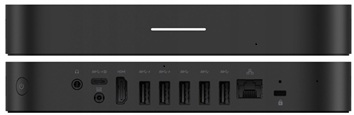

# ASUS MEET GQE10A – i7‑8550U / 32 GB RAM / NVMe 1 TB – Serwer Proxmox (homelab)

## 1. Ogólne

| Kategoria                | Parametr                          | Wartość / Opis                                      |
|--------------------------|-----------------------------------|-----------------------------------------------------|
| Urządzenie               | Model                             | ASUS MEET GQE10A                                   |
|                          | Rola w labie                      | Serwer **Proxmox VE**                              |
|                          | Zastosowanie                      | Wirtualizacja (VM), kontenery (LXC), testy labowe  |
| Architektura             | CPU / platforma                   | Intel x86‑64 (8th gen, Kaby Lake R / ULV)          |
| System bazowy            | Hypervisor                        | Proxmox VE (Debian + KVM/QEMU + LXC)               |

---

## 2. CPU, RAM

| Kategoria                | Parametr                          | Wartość / Opis                                      |
|--------------------------|-----------------------------------|-----------------------------------------------------|
| CPU                      | Model                            | Intel Core **i7‑8550U**                            |
|                          | Rdzenie / wątki                  | 4 rdzenie / 8 wątków                               |
|                          | Taktowanie bazowe                | 1.8 GHz                                             |
|                          | Turbo Boost                      | do ok. 4.0 GHz                                      |
|                          | TDP                              | 15 W (typowo, zależne od ustawień OEM/BIOS)        |
| GPU                      | Zintegrowana grafika             | Intel UHD Graphics 620                              |
| RAM                      | Pojemność                        | **32 GB DDR4 SO‑DIMM** (dual‑channel)              |

---

## 3. Pamięć masowa (pod Proxmox)

| Kategoria                | Parametr                          | Wartość / Opis                                      |
|--------------------------|-----------------------------------|-----------------------------------------------------|
| Dysk główny              | Typ                              | SSD **NVMe 1 TB**                                   |
|                          | Rola                              | Główny datastore Proxmox (VM, LXC, ISO, backup short‑term) |
| Dodatkowy interfejs SATA | Stan                              | **SATA III wolne** – możliwość dołożenia 2.5" SSD/HDD |
| System plików            | Proxmox datastore                 | ext4 / xfs / ZFS (w zależności od konfiguracji)     |

**Homelab – praktyka:**

- NVMe 1 TB: szybki storage dla:
  - VM: Ubuntu Server, Windows Server 2025, Windows 10 Pro, pfSense,
  - LXC i usług testowych.
- Wolny SATA III:
  - idealny pod dodatkowy dysk na backup/snapshots,
  - ewentualnie ZFS mirror (NVMe + SATA SSD, jeśli chcesz kombinować, choć to nieoptymalny mirror).

---

## 4. Złącza / I/O (wg Twojego egzemplarza)

| Kategoria                | Parametr                          | Wartość / Opis                                      |
|--------------------------|-----------------------------------|-----------------------------------------------------|
| USB                      | Porty                             | **5 × USB 3.2** (wysokie transfery, pod dyski, dongle) |
| HDMI                     | Wyjścia                          | **1 × HDMI** – konsola / monitor                    |
| USB‑C / DisplayPort      | Wyjścia                          | **1 × USB‑C / DisplayPort** (alt‑mode)              |
| Ethernet                 | Port                              | **1 × RJ‑45 1 Gbit/s**                              |
| Audio                    | Port                              | **1 × Audio Jack 3.5 mm** (słuchawki / line‑out)   |

**Homelab – praktyka:**

- 1 × 1G RJ‑45:
  - podłączony do Twojej sieci labowej (trunk z VLAN z MT1),
  - idealny jako główny uplink serwera.
- USB 3.2:
  - pod dodatkowe dyski zewnętrzne (backup Proxmox),
  - dongle (np. WiFi/Bluetooth, jeśli kiedyś potrzebne),
  - UPS (USB/serial do monitorowania zasilania).

---

## 5. Zasilanie, chłodzenie, obudowa

| Kategoria                | Parametr                          | Wartość / Opis                                      |
|--------------------------|-----------------------------------|-----------------------------------------------------|
| Zasilanie                | Wejście                          | Zasilacz zewnętrzny (np. 19 V DC, typowy dla ASUS) |
| Pobór mocy               | Idle                              | ~10–20 W (zależnie od obciążenia i liczby VM)       |
|                          | Load                              | ~25–40 W (pełne obciążenie CPU / I/O)              |
| Chłodzenie               | Typ                               | Aktywne (heatpipe + wentylator)                    |
| Obudowa                  | Forma                            | Mały desktop (opcje VESA / montaż do ściany)       |

---

## 6. Aktualny zestaw VM / rola w labie

| VM / Rola                | Parametry przykładowe            | Rola w Twoim homelabie                              |
|--------------------------|-----------------------------------|-----------------------------------------------------|
| **Ubuntu Server 25.04** | VM na Proxmox                     | Serwer linuksowy (aplikacje, testy, usługi)        |
| **Windows Server 2025** | VM na Proxmox                     | AD DS, DNS, GPO, inne usługi domenowe / labowe     |
| **Windows 10 Pro**      | VM na Proxmox                     | Klient domeny / testy GPO / lab użytkownika        |
| **pfSense (testowo)**   | VM na Proxmox                     | Testowa zapora/router wirtualny (scenariusze sieciowe) |

**Możliwy podział zasobów (przykładowy):**

| VM                       | vCPU     | RAM przydzielone       |
|--------------------------|----------|-------------------------|
| Ubuntu Server 25.04      | 2 vCPU   | 4–8 GB                  |
| Windows Server 2025      | 4 vCPU   | 8–12 GB                 |
| Windows 10 Pro           | 2 vCPU   | 4–6 GB                  |
| pfSense (test)           | 2 vCPU   | 2–4 GB                  |

*(Reszta RAM na cache / Proxmox / zapas)*

---

## 7. Podsumowanie – ASUS GQE10A w roli Proxmox node

| Aspekt                   | Ocena / Komentarz                                  |
|--------------------------|----------------------------------------------------|
| CPU i7‑8550U             | Bardzo przyzwoity dla domowego labu               |
| RAM 32 GB                | Wystarczający na kilka VM + LXC                    |
| NVMe 1 TB                | Szybki datastore pod VM i kontenery               |
| Dodatkowy SATA III       | Możliwość łatwego rozszerzenia storage/backup     |
| Złącza                   | 5 × USB 3.2, 1 × HDMI, 1 × USB‑C/DP, 1 × RJ‑45, Audio – komfortowa baza |
| Integracja z labem       | Idealny Proxmox node obok RPi 5 + Mikrotików      |