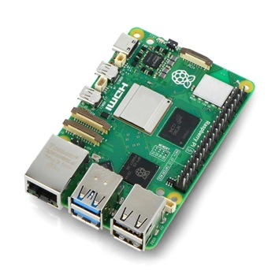

# Raspberry Pi 5 (8 GB RAM) + SSD NVMe 256 GB (PCIe HAT) – Specyfikacja (pod homelab)

## 1. Ogólne

| Kategoria                | Parametr                          | Wartość / Opis                                      |
|--------------------------|-----------------------------------|-----------------------------------------------------|
| Urządzenie               | Model                             | Raspberry Pi 5                                      |
|                          | Wersja RAM                        | **8 GB LPDDR4X**                                    |
|                          | Rola w labie                      | Główny serwer / node Docker / usługi sieciowe      |
|                          | Architektura CPU                  | ARMv8‑A (64‑bit)                                    |
|                          | Typ obudowy                       | Mini‑PC / SBC (zależnie od zastosowanej obudowy)    |
|                          | System operacyjny                 | Ubuntu 25.10 „Questing Quokka” (w Twoim setupie)   |

---

## 2. CPU, GPU, RAM

| Kategoria                | Parametr                          | Wartość / Opis                                      |
|--------------------------|-----------------------------------|-----------------------------------------------------|
| CPU                      | Model                            | Broadcom BCM2712                                    |
|                          | Rdzenie                          | 4 × ARM Cortex‑A76                                  |
|                          | Taktowanie                       | do 2.4 GHz (zależnie od chłodzenia / governor)     |
|                          | Architektura                     | 64‑bit ARMv8‑A                                      |
| GPU                      | Model                            | Broadcom VideoCore VII                              |
|                          | Zastosowanie w labie             | raczej pomijalne (headless serwer)                 |
| RAM                      | Pojemność                        | **8 GB LPDDR4X**                                    |
|                          | Taktowanie efektywne             | ~4267 MT/s (w praktyce zależne od konfiguracji)    |

---

## 3. Pamięć masowa (zestaw z NVMe 256 GB)

| Kategoria                | Parametr                          | Wartość / Opis                                      |
|--------------------------|-----------------------------------|-----------------------------------------------------|
| Nośnik systemowy         | Typ                              | SSD **NVMe 256 GB**                                 |
|                          | Interfejs                         | PCIe 2.0 ×1 (Raspberry Pi 5)                        |
|                          | Montaż                            | HAT / adapter PCIe dla RPi 5                        |
|                          | System plików (typowo)            | ext4 / btrfs (zależnie od konfiguracji)            |
|                          | Rola                              | rootfs + dane (kontenery Docker, logi, bazy danych)|
| microSD                  | Funkcja                          | ewentualnie rescue / instalator / backup            |

**Uwagi homelab:**
- PCIe 2.0 ×1 ≈ do ~4–5 Gbps brutto → ~400–500 MB/s realnego R/W (i tak ogromny skok względem microSD).
- NVMe 256 GB spokojnie wystarcza na:
  - Docker + obrazy + wolumeny,
  - Gitea, monitoring (Prometheus, Loki), Pi‑hole, Traefik, Portainer,
  - snapshoty / backupy baz małej skali.

---

## 4. Interfejsy I/O (sieć, porty)

| Kategoria                | Parametr                          | Wartość / Opis                                      |
|--------------------------|-----------------------------------|-----------------------------------------------------|
| Ethernet                 | Port                              | 1 × 1 Gbit/s RJ45 (MAC + PHY na PCB)               |
|                          | Rzeczywista przepustowość         | ~940 Mbit/s TCP w praktyce                          |
| USB                      | USB 3.0                          | 2 × USB 3.0 Type‑A (5 Gbit/s)                       |
|                          | USB 2.0                          | 2 × USB 2.0 Type‑A                                  |
| HDMI                     | Wyjścia                          | 2 × micro HDMI (max 4Kp60, mało istotne w labie)    |
| PCIe                     | Złącze                           | 1 × PCIe 2.0 ×1 (dedykowane, pod HAT z NVMe)        |
| GPIO                     | Złącze 40‑pin                    | ew. pod przyciski, czujniki, out‑of‑band itd.      |

---

## 5. Zasilanie, chłodzenie, obudowa

| Kategoria                | Parametr                          | Wartość / Opis                                      |
|--------------------------|-----------------------------------|-----------------------------------------------------|
| Zasilanie                | Wejście                          | USB‑C, 5 V DC                                       |
|                          | Rekomendowany zasilacz            | 5 V / 5 A (25 W)                                    |
|                          | Pobór mocy (idle)                 | ~3–6 W (zależnie od usług)                          |
|                          | Pobór mocy (load + NVMe)          | ~10–15 W (może być więcej przy pełnym obciążeniu)   |
| Chłodzenie               | Typ                               | aktywne/pasywne – zależne od obudowy                |
|                          | Rekomendacja                      | radiator + wentylator (przy Docker + NVMe)          |
| Obudowa                  | Typ                               | najlepiej obudowa z miejscem na HAT + NVMe          |

---

## 6. Funkcje istotne dla homelabu

| Obszar                   | Parametr / Funkcja                | Wartość / Opis                                      |
|--------------------------|-----------------------------------|-----------------------------------------------------|
| Wirtualizacja / kontenery| Docker, Docker Compose            | tak (u Ciebie zainstalowane na Ubuntu 25.10)       |
|                          | LXC / Podman / K3s                | możliwe, opcjonalnie                                |
| Sieć                     | VLAN tagging                      | na poziomie hosta (Linux) + Traefik/iptables       |
|                          | Usługi DNS / reverse proxy        | Pi‑hole, Traefik, Portainer, Gitea, monitoring      |
| Dysk i logi              | NVMe jako storage dla wolumenów   | szybkie logi (Loki), TSDB (Prometheus), DB (Postgres, MariaDB) |
| Backup                   | Możliwość snapshotów / rsync      | na zewn. NAS / inne RPi / chmurę                   |

---

## 7. Podsumowanie – RPi 5 8 GB + NVMe w roli serwera labowego

| Aspekt                   | Ocena / Komentarz                                  |
|--------------------------|----------------------------------------------------|
| Wydajność CPU            | Bardzo dobra jak na SBC; 4 × A76 @ 2.4 GHz         |
| RAM 8 GB                 | Wystarczające na kilka–kilkanaście serwisów Docker|
| NVMe 256 GB              | Ogromny plus vs microSD (stabilność + IOPS)       |
| Sieć 1 Gbps              | W zupełności OK jako serwer w VLAN20 (LAB-SRV)    |
| Pobór mocy               | Niski jak na serwer 24/7                          |
| Główna rola w Twoim labie| Serwer usług: Pi‑hole, Traefik, Portainer, Gitea, monitoring, itd. |